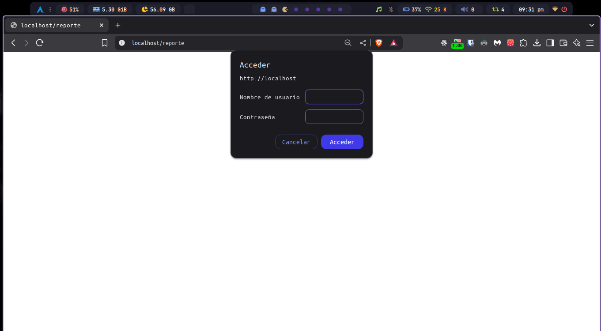
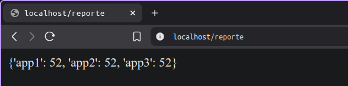
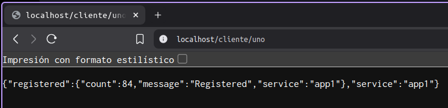
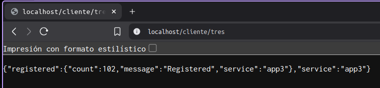
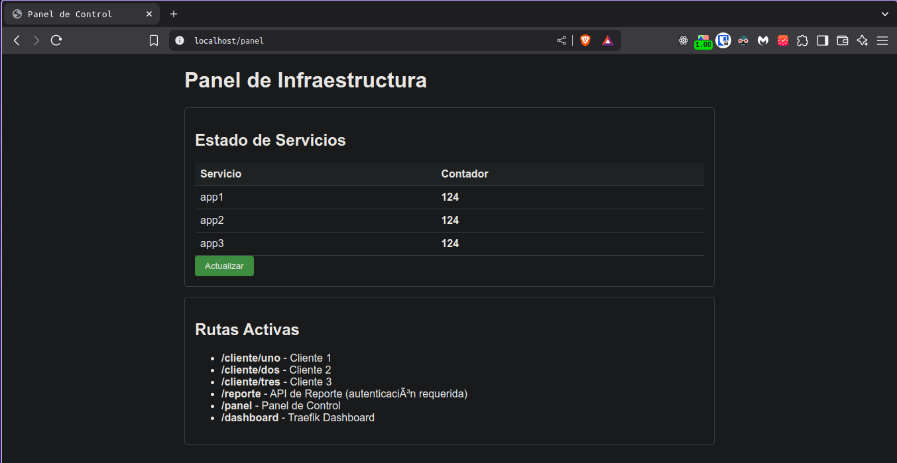

## Endpoints disponibles:

- reporte (localhost/reporte) 
  credenciales: 
  - usuario: admin
  - contraseña: 123

  - resultado la información en texto plano:
  

- clientes (localhost/cliente/uno) (localhost/cliente/dos) (localhost/cliente/tres)

- panel (localhost/panel)
