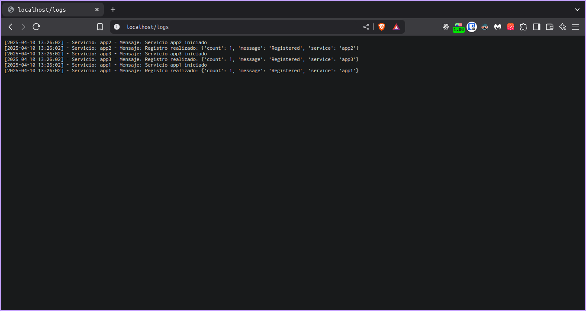

## Endpoints disponibles:

  
 reporte (localhost/reporte) 

credenciales: 
  - usuario: admin
  - contraseña: 123

  - resultado la información en texto plano:

  

  
 clientes (localhost/cliente/uno) (localhost/cliente/dos) (localhost/cliente/tres) 

  
 panel (localhost/panel) 

  
 logs (localhost/logs) 

